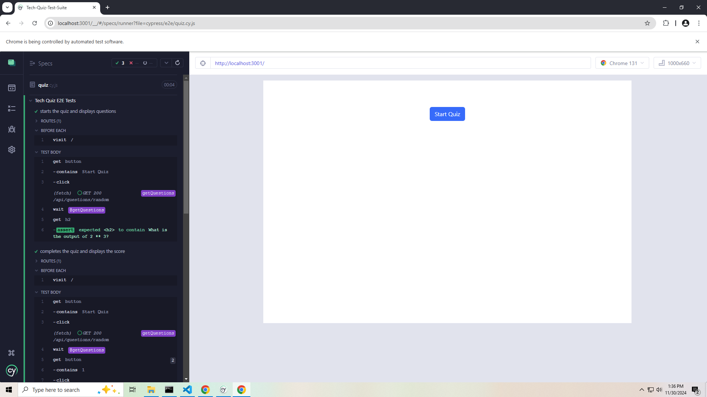

# Tech Quiz Test Suite

The **Tech Quiz Test Suite** is a MERN stack application that allows users to take a tech quiz and view their scores. This repository includes both the application code and Cypress test configurations for E2E and component testing.

  
Click the thumbnail above to watch the walkthrough video!

---

## Table of Contents

1. Getting Started
2. Installation
3. Running the Application
4. Testing with Cypress
5. Technologies Used

---

## Getting Started

To get started with the **Tech Quiz Test Suite**, follow the steps below to clone the repository, install dependencies, and run the application.

### Prerequisites

Make sure you have the following installed:
- Node.js (v16+ recommended)
- npm or yarn
- MongoDB (running locally or accessible via a URI)

---

## Installation

1. Clone the repository:

git clone https://github.com/KenKuffler/Tech-Quiz-Test-Suite.git  
cd Tech-Quiz-Test-Suite

2. Install dependencies for both client and server:

npm install

3. Set up the environment variables:  
Rename the `.env.example` file to `.env` in the `server` directory.  
Update the `MONGODB_URI` variable in the `.env` file to point to your MongoDB instance.

---

## Running the Application

1. Start the server and client:

npm start

2. Open your browser and visit:

http://localhost:3001

---

## Testing with Cypress

### Running End-to-End Tests

1. Start the application (server and client must be running):

npm start

2. Open Cypress Test Runner for E2E testing:

npx cypress open

3. Select the E2E Tests option and run the tests in the `cypress/e2e/` directory.

### Running Component Tests

1. Open Cypress Test Runner for component testing:

npx cypress open --component

2. Select the Component Tests option and run the tests in the `cypress/component/` directory.

---

## Technologies Used

- Frontend: React, Bootstrap
- Backend: Node.js, Express, MongoDB
- Testing: Cypress (E2E and component testing)
- Build Tools: Vite

---